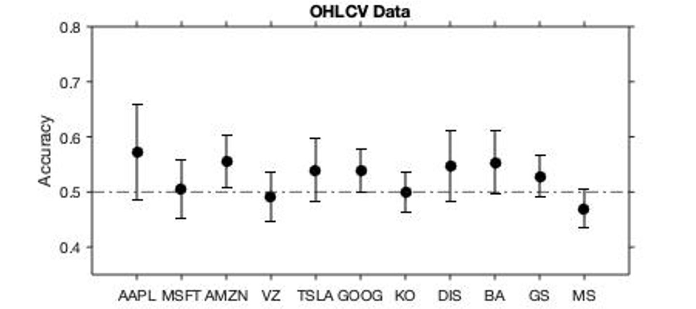
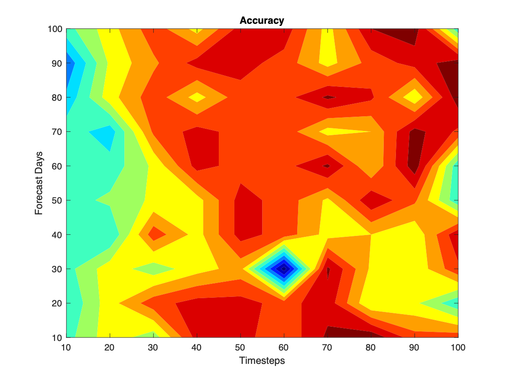
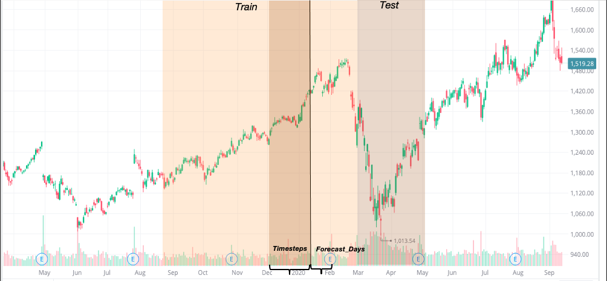
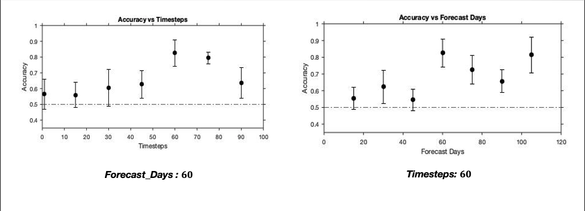

# Stock-Prediction

A machine learning approach to prdicting stock price movement.

# Introduction
Different price prediction methods have been proposed using various machine
learning methods such as support vector machines, random trees, neural networks
have been proposed. In this project we focus on recurrent neural networks(RNN) 
by creaing a model based on three layers of long short term memory (LSTM) cells.

By first constructing a crude model and experimenting with raw data, we find
that the odds are no different from that of guessing.

For better approximation we convert raw data in to technical indicators and feed
them into the our network under given paramters. The end result is a contour plot
between our given paramters and the corresponding accuracy at each point.

# Requirements
python 3.8.6 (developed used pyenv)
AlphaVantage for raw data

# Parameters

We investiage the relationship of two parameters per point to the up/down of
price movement.

`timesteps` : the number of data points fed into the network
`forecast_days` : the number of days forward the program aims to predict

# Usage
Once running the program, it will first prompt

`Type symbol of stock to be analyzed:`

The `run.py` is executed, it will return a contour plot 

# Results

We can notice that for each set of data, there is a peak - an optimal paramter that
yields highest accuracy. Perhaps these paramters can be used as pointers
when testing in the real world.

